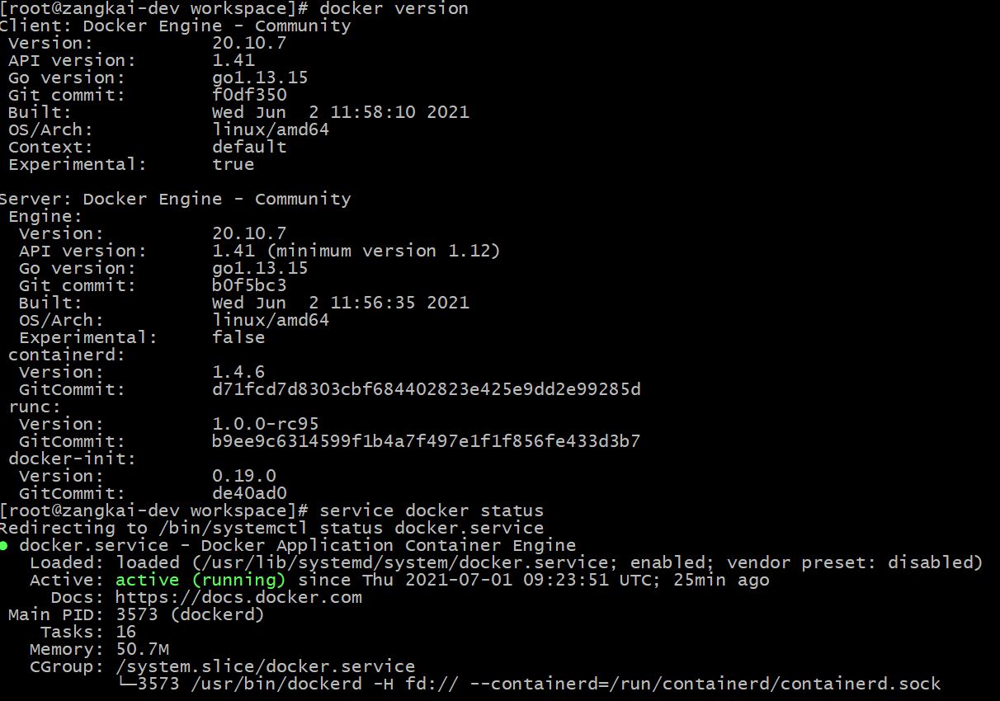
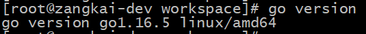

## 系统

- OS: CentOS (any other Linux distrubite)
- User: root
- Proxy

### 网络配置

#### DNS [Optional]

```bash
# Update dns address if the machine is working in LAN 
echo "nameserver 114.114.114.114" >> /etc/resolv.conf
```

#### Proxy [Optional]

```bash
# Set proxy if the machine cannot acccess some needed resources
cat <<EOF >> ~/.bashrc
export http_proxy="http://x.x.x.x:xxxx"
export https_proxy="http://x.x.x.x:xxxx"
export no_proxy="127.0.0.1,localhost"
EOF
```

## 工具

### Docker

参考[官方指导](https://docs.docker.com/engine/install/centos/#install-using-the-repository)基于**yum**安装最新的Docker CE版本

#### 更新已安装程序

```bash
yum update
```

#### 添加Docker官方源

```bash
yum-config-manager --add-repo https://download.docker.com/linux/centos/docker-ce.repo
```

#### 安装Docker相关应用

```bash
yum install docker-ce docker-ce-cli containerd.io
```

#### 启动dockerd

```bash
# start docker at boot
systemctl enable docker
systemctl start docker
```

#### 检查



### Golang SDK

#### 下载

```bash
curl -SLO https://go.dev/dl/go1.16.5.linux-amd64.tar.gz
tar -zxf go1.16.5.linux-amd64.tar.gz
ln -s /usr/local/go ./go1.16.5
```

#### 环境变量

```bash
sudo cat <<EOF >> /etc/profile.d/golang.sh
export GOROOT="/usr/local/go"
export GOPATH="/usr/local/gopath"
export PATH="$PATH:$GOROOT/bin:$GOPATH/bin"
EOF
```

#### 检查



### [kind](https://kind.sigs.k8s.io/)

kind为k8s兴趣小组中的热门工具之一，能够快速部署轻量级的k8s集群，主要用于k8s相关的功能调试与CICD等场景

#### 安装

```bash
# with --install with version of go1.17+
go get sigs.k8s.io/kind
```

#### 创建集群

> 此过程会拉取体积较大的容器镜像，需要等待一段时间

若考虑将集群用于长期测试，需要在创建时配置网络和镜像仓库

##### 配置网络

如果仅从本机访问集群，直接创建即可

```bash
# 可通过--name指定集群名称
kind create cluster 
```

如果需要从节点外部访问新建的集群，需要通过配置文件指定集群的apiserver映射到节点上的监听地址。配置文件可参考[官方说明文档](https://kind.sigs.k8s.io/docs/user/configuration/#api-server)

```yaml
kind: Cluster
apiVersion: kind.x-k8s.io/v1alpha4
networking:
  # WARNING: It is _strongly_ recommended that you keep this the default
  # (127.0.0.1) for security reasons. However it is possible to change this.
  apiServerAddress: "127.0.0.1"
```

修改上述配置文件内容中的`networking.apiServerAddress`字段为期望监听的节点IP地址

##### 配置镜像仓库

kind支持指定集群使用部署在同一机器上的同一容器网络下的镜像仓库服务，同样需要在配置文件中指定仓库地址，可参考[官方说明文档](https://kind.sigs.k8s.io/docs/user/local-registry/)

启动镜像仓库时，需配置

- `--network=kind`

  指定容器网络，与kind集群运行在同一个子网中，保证能够互相访问

  > 如果是第一次使用kind创建集群，则此名为kind的容器网络还未被创建，可以先省略此配置项，待集群创建成功后，执行`docker network connect kind local-registry`命令，给仓库容器添加kind容器网络的网卡，使其能够互相访问

- `-p 127.0.0.1:5000:5000`

  映射容器内镜像仓库的监听端口到宿主机，保证能够在宿主机上直接上镜像，然后在集群中拉取

  > 此处监听的是本地地址，如果需要从外部访问，可以修改为`5000:5000`，但是安全性会大大降低

- `-v /mnt/registry:/var/lib/registry`

  挂载宿主机上指定目录（如`/mnt/registry`）到容器中存放镜像文件的目录（如`/var/lib/registry`），保证容器重启或者重建时，无需重新上传一些基础镜像

```bash
docker run -d --restart=always --network=kind -p 5000:5000 -v /mnt/registry:/var/lib/registry --name local-registry registry:2
```

配置文件如下

```yaml
kind: Cluster
apiVersion: kind.x-k8s.io/v1alpha4
containerdConfigPatches:
- |-
  [plugins."io.containerd.grpc.v1.cri".registry.mirrors."avalon.dev:5000"]
    endpoint = ["http://local-registry:5000"]
```

- 配置项`containerdConfigPatches`的值表示将添加到containerd[配置文件](https://github.com/containerd/cri/blob/master/docs/registry.md#configure-registry-tls-communication)中的内容，默认的配置文件路径为`/etc/containerd/config.toml`

  > `crictl`和`kubectl`都会读取containerd的配置文件

  - `plugins."io.containerd.grpc.v1.cri".registry.mirrors."localhost:5000"`表示使用名为`io.containerd.grpc.v1.cri`的插件，并设置该插件的`registry.mirrors."avalon.dev:5000"`配置项；
- `registry.mirrors`为该插件内置的配置项，表示镜像仓库列表
  
    - `avalon.dev:5000`为新增的动态子配置项，代表指定的镜像仓库地址，默认格式为`host:port`。此处我们使用localhost代表镜像仓库名称，那么在k8s的相关yaml中的镜像地址都以localhost开头，例如`image: avalon.dev:5000/alpine`
    
- `endpoint = ["http://local-registry:5000"]`表示该镜像仓库实际访问地址，此示例中即我们启动的镜像仓库容器的名称和端口

##### 创建集群

完成上述配置后，即可创建集群。创建集群时注意

- 如果执行环境中存在代理配置，需要添加免代理名单，将镜像仓库容器的名称和镜像仓库访问地址添加到`no_proxy`环境变量中，避免kind中的CRI访问镜像仓库容器时走代理
- 指定配置文件

```bash
kind create cluster --name kyle --config ./config.yaml
```

##### 测试

- 本地开发环境上传镜像

    ```bash
    # 此处可使用镜像仓库容器所在的远程地址进行推送，或者配置hosts使用
    docker tag alpine 172.16.80.184:5000/alpine
    
    docker tag alpine avalon.dev:5000/alpine
    docker push avalon.dev:5000/alpine
    ```

- 创建deployment引用刚刚上传的镜像

    ```bash
    # 此处使用containerd配置中的镜像仓库地址拉取镜像
    kubectl create deployment tmp --image="avalon.dev:5000/alpine"
    ```

- 检查镜像拉取状况

  ```bash
  kubectl describe po xxx
  # 或者
  kubectl get event
  ```

### kubectl

#### 下载

```bash
curl -LO "https://dl.k8s.io/release/$(curl -L -s https://dl.k8s.io/release/stable.txt)/bin/linux/amd64/kubectl"
```

#### 配置

##### 注册到系统执行文件路径Path

```bash
# <kubectl_home>代指存放kubectl工具的目录
echo "export PATH="$PATH:<kubectl_home>" >> ~/.bashrc
```

##### kubeconfig

使用kind创建集群时，如果系统中不存在kubeconfig文件，则会默认生成一份，否则累加新集群的配置

## 环境配置

### Dashboard (Optional)

[kubernetes/dashboard](https://github.com/kubernetes/dashboard)是k8s社区的官方UI项目，用于展示各种k8s对象的状态与详情，如果熟悉kubectl的CLI操作，则无需使用dashboard。此处通过安装dashboard验证新建的k8s集群的基本功能

#### 安装

```bash
kubectl apply -f https://raw.githubusercontent.com/kubernetes/dashboard/v2.3.1/aio/deploy/recommended.yaml
```

#### 访问

dashboard运行在集群内部，无法直接访问。在功能验证场景中，我们可以使用kubectl的`proxy`或者`port-forward`能力进行转发

```bash
# 可通过--address=x.x.x.x指定proxy监听的地址
kubectl proxy
```

最后通过转发地址 `http://localhost:8001/api/v1/namespaces/kubernetes-dashboard/services/https:kubernetes-dashboard:/proxy/` 进行访问

### 权限

访问dashboard时，登录页面会要求指定访问Token或者包含Token的kubeconfig配置文件。建议选择集群中某个固定的ServiceAccount（例如**kube-system**下的**default**），绑定**ClusterAdmin**的ClusterRoleBinding，即可获取集群内所有资源的访问以及管理权限

```bash
# 赋予kube-system命名空间下的服务账户default cluster-admin的角色
kubectl create clusterrolebinding kube-admin --clusterrole cluster-admin --serviceaccount kube-system:default
```

接下来获取该ServiceAccount的token

```bash
# 获取ServiceAccount用于存储token的secret名称
kubectl get sa default -nkube-system -ojsonpath='{.secrets[0].name}'

# 从secret中获取token
kubectl get secret <secret_name> -nkube-system -ojsonpath='{.data.token}' | base64 -d
```

将获取的token配置给kubeconfig中默认的用户

```bash
# <token>通过上述命令获取
kubectl config set-credentials <user_name> --token=<token>
```

### 外部访问

由于kind实现机制，部署在kind集群中的应用与外部存在网络隔离，即使是**NodePort**类型的Service也无法从外部访问，需要借助其他代理手段

#### kubectl

kubectl工具支持代理功能，但是仅适用于临时调试场景，无法稳定持续地运行

##### proxy

```bash
kubectl proxy

kubectl proxy --address <node_ip>

# 后台异步运行，但仍会自动退出
nohup kubectl proxy &
```

启动proxy后，即可通过

`http://<node_ip>:8001/api/v1/namespaces/<namespace>/services/<protocol>:<service>:<path>`

格式的URL地址访问集群中的指定命名空间下的指定Service，并指定了访问路径

##### port-forward

```bash
kubectl port-forward TYPE/NAME <local_port>:<remote_port>

kubectl port-forward --address localhost,10.19.21.23 pod/mypod 8888:5000
```

启动转发后，通过指定的代理地址和端口即可访问

#### NodePort Service + [socat](http://www.dest-unreach.org/socat/)

基于socat的代理功能，转发通往容器网络内的请求

本方案能够持久稳定运行，缺点是每个对外发布的服务都需要启动对应的socat代理容器

- 在k8s集群内创建NodePort类型的Service，使服务在kind容器网络内能够被自由访问
- 在宿主机上运行socat容器，指定基于kind容器网络运行，同时容器对宿主机映射容器内端口，做到转发功能

> **About socat**
>
> *From [README](http://www.dest-unreach.org/socat/doc/README)*
>
> *socat is a relay for bidirectional data transfer between two independent data*
> *channels. Each of these data channels may be a file, pipe, device (serial line*
> *etc. or a pseudo terminal), a socket (UNIX, IP4, IP6 - raw, UDP, TCP), an*
> *SSL socket, proxy CONNECT connection, a file descriptor (stdin etc.), the GNU*
> *line editor (readline), a program, or a combination of two of these.* 
> *These modes include generation of "listening" sockets, named pipes, and pseudo*
> *terminals.*
>
> *socat can be used, e.g., as TCP port forwarder (one-shot or daemon), as an*
> *external socksifier, for attacking weak firewalls, as a shell interface to UNIX*
> *sockets, IP6 relay, for redirecting TCP oriented programs to a serial line, to*
> *logically connect serial lines on different computers, or to establish a*
> *relatively secure environment (su and  chroot) for running client or server*
> *shell scripts with network connections.* 

socat运行配置如下

- docker run参数

  - `--network kind`

    与kind的master节点容器使用同一个容器网络（即默认名为kind的容器网络）

  - `--publish <host_ip>:<host_port>:<container_port> `

    发布端口，将容器内监听的端口映射到宿主机上，地址为外部访问时使用的IP地址

- socat运行参数

  - `-dd`

    即`-d -d`，打印致命、错误、警告以及提示信息

  - `tcp-listen:<port>,fork,reuseaddr`

    - 指定socat监听的本机端口
    - **[fork](http://www.dest-unreach.org/socat/doc/socat.html#OPTION_FORK)**：通过子进程处理新建的连接
    - **[reuseaddr](http://www.dest-unreach.org/socat/doc/socat.html#OPTION_REUSEADDR)**：允许其他socket绑定此地址，即使socat已经绑定了相关端口:question:

  - `tcp-connect:<service_host>:<service_port>`

    指定转发后端的地址和端口，即从socat容器内访问目标Service的地址

    - 对于NodePort类型的Service来说，通过其所在的集群中的任意节点都能访问到它，故此处使用master节点在kind容器网络中分配到的IP地址。由于socat容器也使用了此容器网络，故网络上可到达
    - master节点上转发到Service的端口，由k8s动态分配，通过查询Service的命令即可获得

综上，运行socat代理容器的命令为

```bash
# port为任意未监听的端口
docker run --rm -d --name kind-proxy-<port> \
--publish <host>:<port>:<port> --network kind \
alpine/socat -dd \
tcp-listen:<port>,fork,reuseaddr \
tcp-connect:<kind_node_ip>:<service_port>

# e.g.
docker run --rm -d --name dashboard-proxy --publish 0.0.0.0:8888:8888 --network kind alpine/socat -dd tcp-listen:8888,fork,reuseaddr tcp-connect:172.18.0.2:30382
```

#### ingress controller

基于nodeport service + socat转发机制，使用ingress controller做反向代理

##### 安装

```bash
kubectl apply -f https://raw.githubusercontent.com/kubernetes/ingress-nginx/main/deploy/static/provider/kind/deploy.yaml
```

##### 启动ingress代理

```bash
docker run --rm -d --name ingress-proxy --publish 0.0.0.0:9090:9090 --network kind alpine/socat -dd tcp-listen:9090,fork,reuseaddr tcp-connect:172.18.0.3:{ingress_nodeport_service_port}
```

