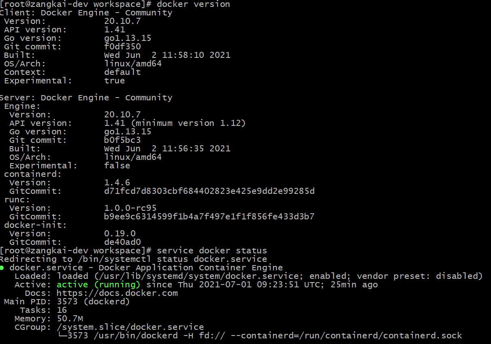

## 环境

### OS

Debian Bullseye (or any other Linux distrubite with APT package management tool)

### 网络

- DNS

    ```bash
    # [Optional] Update dns address if the machine is working in LAN 
    echo "nameserver 114.114.114.114" >> /etc/resolv.conf
    ```

- Proxy

    ```bash
    # [Optional] Set proxy if needed
    cat <<EOF >> ~/.bashrc
    export http_proxy="http://x.x.x.x:xxxx"
    export https_proxy="http://x.x.x.x:xxxx"
    export no_proxy="127.0.0.1,localhost"
    EOF
    ```

## 安装

### Docker

参考[官方指导](https://docs.docker.com/engine/install/debian/)， 使用`apt-get`安装最新的Docker CE版本

- **安装必要工具**

    ```bash
    sudo apt update
    sudo apt install ca-certificates curl gnupg lsb-release
    ```

- **添加包源**

    ```bash
    # load gpg key of docker official apt repo
    sudo mkdir -p /etc/apt/keyrings
    curl -fsSL https://download.docker.com/linux/debian/gpg | sudo gpg --dearmor -o /etc/apt/keyrings/docker.gpg
    
    # add docker official apt repo
    echo "deb [arch=$(dpkg --print-architecture) signed-by=/etc/apt/keyrings/docker.gpg] https://download.docker.com/linux/debian $(lsb_release -cs) stable" | sudo tee /etc/apt/sources.list.d/docker.list > /dev/null
    ```

- **安装**

    ```bash
    sudo apt update	
    # no docker-compose
    sudo apt install docker-ce docker-ce-cli containerd.io
    ```

- **检查**

    
    
- **配置**（可选）

    如果需要与非HTTPS镜像仓库交互，需要在daemon的[配置文件](https://docs.docker.com/engine/reference/commandline/dockerd/#daemon-configuration-file)中添加仓库地址

    ```json
    // /etc/docker/daemon.json
    {
    	"insecure-registries": [
    		"localhost:5000"
    	]
    }
    ```

    然后重启daemon服务

    ```bash
    sudo systemctl restart docker
    ```

### Golang

- **下载**

    ```bash
    curl -SLO https://go.dev/dl/go1.18.4.linux-amd64.tar.gz
    tar -zxf go1.18.4.linux-amd64.tar.gz
    sudo mv go /usr/local/go1.18.4
    sudo ln -s /usr/local/go1.18.4 /usr/local/go
    ```

- **环境变量**

    ```bash
    # /etc/profile.d/golang.sh
    export GOROOT="/usr/local/go"
    export GOPATH="/usr/local/gopath"
    export PATH="$PATH:$GOROOT/bin:$GOPATH/bin"
    ```
    
- **检查**

    ```bash
    go version
    ```

### [kind](https://kind.sigs.k8s.io/)

kind为k8s兴趣小组中的热门工具之一，能够快速部署轻量级的k8s集群，主要用于k8s相关的功能调试与CICD等场景

- **安装**

    ```bash
    go install sigs.k8s.io/kind@latest
    ```

- **配置集群**

    若考虑将集群用于长期测试，建议对集群进行定制。详细配置项可见[官方说明文档](https://kind.sigs.k8s.io/docs/user/configuration)

    ```yaml
    kind: Cluster
    apiVersion: kind.x-k8s.io/v1alpha4
    name: avalon
    networking:
      # specify the listen address if users want to acess outside the host
      apiServerAddress: "127.0.0.1"
    nodes:
    - role: control-plane
    - role: worker
      extraMounts:
      - hostPath: /path/to/share
        containerPath: /data
      extraPortMappings:
      - containerPort: 80
        hostPort: 80
    # config the container registry
    containerdConfigPatches:
    - |-
      [plugins."io.containerd.grpc.v1.cri".registry.mirrors."localhost:5000"]
        endpoint = ["http://local-registry:5000"]
    ```

    kind支持自定义镜像仓库地址，建议使用本地运行镜像仓库容器。启动镜像仓库容器时，需注意的配置如下

    ```bash
    docker run -d --restart=always -p 5000:5000 -v /mnt/registry:/var/lib/registry --name local-registry registry:2
    ```

    - `-p 127.0.0.1:5000:5000`

      映射容器内镜像仓库的监听端口到宿主机，保证能够在宿主机上直接上传镜像，然后在集群中拉取
      
      > 此处监听的是本地地址，如果需要从外部访问，可以修改为`5000:5000`，但是安全性会大大降低

    - `-v /mnt/registry:/var/lib/registry`
      
      挂载容器中存放镜像文件的目录（默认为`/var/lib/registry`）到宿主机上指定目录（如`/mnt/registry`），持久化存储的镜像文件

    镜像仓库容器运行后，即可配置集群

    ```yaml
    kind: Cluster
    apiVersion: kind.x-k8s.io/v1alpha4
    containerdConfigPatches:
    - |-
        [plugins."io.containerd.grpc.v1.cri".registry.mirrors."localhost:5000"]
          endpoint = ["http://local-registry:5000"]
    ```

    配置项`containerdConfigPatches`的值表示将添加到containerd[配置文件](https://github.com/containerd/cri/blob/master/docs/registry.md#configure-registry-tls-communication)中的内容，默认的配置文件路径为`/etc/containerd/config.toml`

    > `crictl`和`kubectl`都会读取containerd的配置文件

    - `plugins."io.containerd.grpc.v1.cri".registry.mirrors."localhost:5000"`表示使用名为`io.containerd.grpc.v1.cri`的插件，并设置该插件的`registry.mirrors."localhost:5000"`配置项；
    - `registry.mirrors`为该插件内置的配置项，表示镜像仓库列表，其子项`localhost:5000`为新增的动态子配置项，代表指定的镜像仓库地址，默认格式为`host:port`。此处我们使用localhost代表镜像仓库名称，那么在k8s的相关yaml中的镜像地址都以localhost开头，例如`image: localhost:5000/alpine`
    - `endpoint = ["http://local-registry:5000"]`表示该镜像仓库实际访问地址，此示例中即我们启动的镜像仓库容器的名称和端口

- **创建集群**

  > 如果执行环境中存在代理配置，需要添加免代理名单，将镜像仓库容器的名称和镜像仓库访问地址添加到`no_proxy`环境变量中，避免kind中的CRI访问镜像仓库容器时走代理

    ```bash
    kind create cluster --config config.yaml
    ```

  > 此过程会拉取体积较大的容器镜像，需要等待一段时间

  kind在初始化集群过程中，会创建专用的容器网络`kind`。为了能够正常访问镜像仓库容器，需要将镜像仓库容器加入到此网络中

  ```bash
  docker network connect kind local-registry
  ```

- **测试**

    + 本地开发环境上传镜像
    
        ```bash
        # 此处可使用镜像仓库容器所在的远程地址进行推送，或者配置hosts使用
        docker tag alpine localhost:5000/alpine
        docker push localhost:5000/alpine
        ```
        
    + 拉取镜像创建Pod
    
        ```bash
        kubectl run tmp --rm -i --restart='Never' --wait --image="localhost:5000/alpine"
        ```

### kubectl

- **安装**

    ```bash
    curl -LO "https://dl.k8s.io/release/$(curl -L -s https://dl.k8s.io/release/stable.txt)/bin/linux/amd64/kubectl"
    sudo mv kubectl /usr/local/bin/
    ```

- **配置**

    > 使用kind创建集群时，如果系统中不存在kubeconfig文件，则会默认生成一份，否则累加新集群的配置
    
    ```bash
    kubectl config view
    
    # check kubeconfig file
    ll ~/.kube/config
    echo $KUBECONFIG
    ```
    
- [**自动补全**](https://kubernetes.io/docs/tasks/tools/included/optional-kubectl-configs-bash-linux/)

    配置完成后需要重新运行bash

    ```bash
    kubectl completion bash | sudo tee /etc/bash_completion.d/kubectl > /dev/null
    
    # \w alias
    echo 'alias k=kubectl' >>~/.bashrc
    echo 'complete -o default -F __start_kubectl k' >>~/.bashrc
    
    exec bash
    ```

## 配置

### Dashboard (Optional)

[kubernetes/dashboard](https://github.com/kubernetes/dashboard)是k8s社区的官方UI项目，用于展示各种k8s对象的状态与详情，如果熟悉kubectl的CLI操作，则无需使用dashboard。此处通过安装dashboard验证新建的k8s集群的基本功能

- **安装**

    ```bash
    kubectl apply -f https://raw.githubusercontent.com/kubernetes/dashboard/v2.3.1/aio/deploy/recommended.yaml
    ```

- **访问**

    dashboard运行在集群内部，无法直接访问。在功能验证场景中，我们可以使用kubectl的`proxy`或者`port-forward`能力进行转发
    
    ```bash
    # 可通过--address=x.x.x.x指定proxy监听的地址
    kubectl proxy
    ```
    
    最后通过转发地址 `http://localhost:8001/api/v1/namespaces/kubernetes-dashboard/services/https:kubernetes-dashboard:/proxy/` 进行访问

### 权限

访问dashboard时，登录页面会要求指定访问Token或者包含Token的kubeconfig配置文件。建议选择集群中某个固定的ServiceAccount（例如**kube-system**下的**default**），绑定**ClusterAdmin**的ClusterRoleBinding，即可获取集群内所有资源的访问以及管理权限

```bash
# 赋予kube-system命名空间下的服务账户default cluster-admin的角色
kubectl create clusterrolebinding kube-admin --clusterrole cluster-admin --serviceaccount kube-system:default
```

接下来获取该ServiceAccount的token

```bash
# 获取ServiceAccount用于存储token的secret名称
kubectl get sa default -nkube-system -ojsonpath='{.secrets[0].name}'

# 从secret中获取token
kubectl get secret <secret_name> -nkube-system -ojsonpath='{.data.token}' | base64 -d
```

将获取的token配置给kubeconfig中默认的用户

```bash
# <token>通过上述命令获取
kubectl config set-credentials <user_name> --token=<token>
```

### 外部访问

由于kind实现机制，部署在kind集群中的应用与外部存在网络隔离，即使是**NodePort**类型的Service也无法从外部访问，需要借助其他代理手段

- **kubectl**

	kubectl工具支持代理功能，但是仅适用于临时调试场景，无法稳定持续地运行

	+ proxy

    ```bash
    kubectl proxy --address <external_address>
    ```
    
    启动proxy后，即可通过
    
    `http://<external_address>/api/v1/namespaces/<namespace>/services/<protocol>:<service>:<path>`
    
    格式的URL地址访问集群中的指定命名空间下的指定Service，并指定了访问路径
    
  + port-forward
  
    ```bash
    kubectl port-forward TYPE/NAME <local_port>:<remote_port>
    kubectl port-forward --address localhost,10.19.21.23 pod/mypod 8888:5000
	  ```
    
    启动转发后，通过指定的代理地址和端口即可访问
  
- [**socat**](http://www.dest-unreach.org/socat/)

    基于socat的代理功能，转发通往容器网络内的请求

    本方案能够持久稳定运行，缺点是每个对外发布的服务都需要启动对应的socat代理容器

    + 在k8s集群内创建`NodePort`类型的Service，使服务在kind容器网络内能够被自由访问
    + 在宿主机上运行socat容器，指定基于kind容器网络运行，同时容器对宿主机映射容器内端口，做到转发功能

    > **About socat**
    >
    > *From [README](http://www.dest-unreach.org/socat/doc/README)*
    >
    > *socat is a relay for bidirectional data transfer between two independent data*
    > *channels. Each of these data channels may be a file, pipe, device (serial line*
    > *etc. or a pseudo terminal), a socket (UNIX, IP4, IP6 - raw, UDP, TCP), an*
    > *SSL socket, proxy CONNECT connection, a file descriptor (stdin etc.), the GNU*
    > *line editor (readline), a program, or a combination of two of these.* 
    > *These modes include generation of "listening" sockets, named pipes, and pseudo*
    > *terminals.*
    >
    > *socat can be used, e.g., as TCP port forwarder (one-shot or daemon), as an*
    > *external socksifier, for attacking weak firewalls, as a shell interface to UNIX*
    > *sockets, IP6 relay, for redirecting TCP oriented programs to a serial line, to*
    > *logically connect serial lines on different computers, or to establish a*
    > *relatively secure environment (su and  chroot) for running client or server*
    > *shell scripts with network connections.* 

    socat运行配置如下

    + docker run参数

      - `--network kind`

        配置集群运行的容器网络

      - `--publish <host_ip>:<host_port>:<container_port> `

        发布端口，将容器内监听的端口映射到宿主机上，地址为外部访问时使用的IP地址

    + socat运行参数

      - `-dd`

        即`-d -d`，打印致命、错误、警告以及提示信息

      - `tcp-listen:<port>,fork,reuseaddr`

        - 指定socat监听的本机端口
        - **[fork](http://www.dest-unreach.org/socat/doc/socat.html#OPTION_FORK)**：通过子进程处理新建的连接
        - **[reuseaddr](http://www.dest-unreach.org/socat/doc/socat.html#OPTION_REUSEADDR)**：允许其他socket绑定此地址，即使socat已经绑定了相关端口:question:

      - `tcp-connect:<service_host>:<service_port>`

        指定转发后端的地址和端口，即从socat容器内访问目标Service的地址

        - 对于NodePort类型的Service来说，通过其所在的集群中的任意节点都能访问到它，故此处使用master节点在kind容器网络中分配到的IP地址。由于socat容器也使用了此容器网络，故网络上可到达
        - master节点上转发到Service的端口，由k8s动态分配，通过查询Service的命令即可获得

    综上，运行socat代理容器的命令为

    ```bash
    # port为任意未监听的端口
    docker run --rm -d --name kind-proxy-<port> \
    --publish <host>:<port>:<port> --network kind \
    alpine/socat -dd \
    tcp-listen:<port>,fork,reuseaddr \
    tcp-connect:<kind_node_ip>:<service_port>

    # e.g.
    docker run --rm -d --name dashboard-proxy --publish 0.0.0.0:8888:8888 --network kind alpine/socat -dd tcp-listen:8888,fork,reuseaddr tcp-connect:172.18.0.2:30382
    ```

- **ingress controller**

    基于nodeport service + socat转发机制，使用ingress controller做反向代理

    + 安装

        ```bash
        kubectl apply -f https://raw.githubusercontent.com/kubernetes/ingress-nginx/main/deploy/static/provider/kind/deploy.yaml
        
        # add label ingress-ready=true to node for runing nginx pod
        kubectl edit node {worker_node}
        ```
    
    + 启动ingress代理
    
      > 若通过kind创建集群时已经配置80端口转发，则无需运行socat代理容器
    
        ```bash
        docker run --rm -d --name ingress-proxy --publish 0.0.0.0:9090:9090 --network kind alpine/socat -dd tcp-listen:9090,fork,reuseaddr tcp-connect:172.18.0.3:{ingress_nodeport_service_port}
        ```

